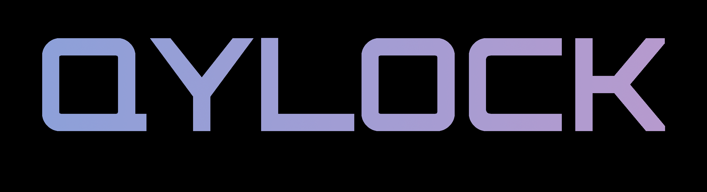
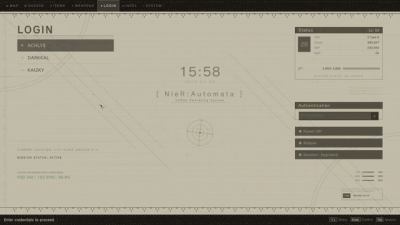
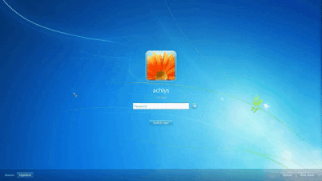
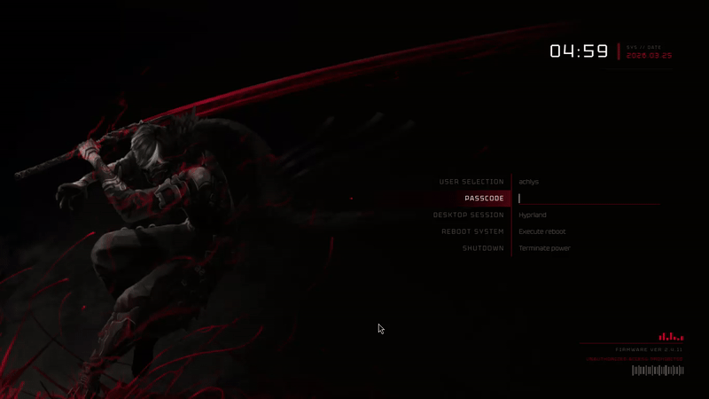

<p align="center">
<pre align="center">
<a href="#sddm">sᴅᴅᴍ​​</a>  •  <a href="#quickshell">​ǫᴜɪᴄᴋsʜᴇʟʟ​</a>  •  <a href="#nix">​ɴɪx​</a>  •  <a href="#gallery">​ɢᴀʟʟᴇʀʏ</a>  •  <a href="#credits">​ᴄʀᴇᴅɪᴛs</a>
</pre>
</p>




<div align="left">
  <a href="https://github.com/sddm/sddm"></a>
  <a href="https://www.qt.io"></a>
  
  <div align="right">
    <details>
      <summary>☕ sᴜᴘᴘᴏʀᴛ ᴍʏ ᴡᴏʀᴋ</summary>
      <p align="right">
        <br>
        
        <br><br>
        <i>Means a lot, tysm <3</i>
      </p>
    </details>
  </div>
</div>

---

<br>

###  ᴏᴠᴇʀᴠɪᴇᴡ
A simple collection of all the lockscreen themes I've made. It comes with a theme changer script so you don't have to worry about moving files manually. 

<br>

---

<div align="center">
  <h2 id="sddm">  ꜱᴅᴅᴍ ꜱᴇᴛᴜᴘ  </h2>
</div>

### ⚡ ɪɴꜱᴛᴀʟʟᴀᴛɪᴏɴ ᴀɴᴅ ᴜꜱᴀɢᴇ

**1. Install Dependencies:**
Make sure you have these packages installed via your system's package manager (names might differ slightly on your distro):
- `sddm`, `qt5-graphicaleffects`, `qt5-multimedia`, `qt5-quickcontrols`, `qt5-quickcontrols2`, `qt5-svg`

**NixOS / Nix users:** A `flake.nix` dev shell is included. Run `nix develop` to get all dependencies (SDDM, Qt6, qt5compat shims, Quickshell, fzf) in one step. See the [Nix section](#nix) below.

**2. Use the Setup Script:**
Simply run the interactive script to select and apply your themes. As long as you have the dependencies, this will handle the rest.
> [!IMPORTANT]
> The `sddm.sh` script works best with `fzf` installed, but will fallback to a simple list if needed.

```sh
chmod +x sddm.sh
./sddm.sh
```

### 󱔗 ꜰᴏɴᴛ ʀᴇǫᴜɪʀᴇᴍᴇɴᴛꜱ
Some themes in this collection use premium or trademarked fonts that cannot be redistributed in this repository. If you choose one of these themes, you will need to manually download the font and place it in the theme's `font` subfolder.

| Theme | Recommended Font | File Name (approx) |
| :--- | :--- | :--- |
| **NieR: Automata** | FOT-Rodin Pro DB | `FOT-Rodin Pro DB.otf` |
| **Terraria** | Andy Bold | `Andy Bold.ttf` |
| **Genshin Impact** | HYWenHei-85W | `zhcn.ttf` |
| **Sword** | The Last Shuriken | `The Last Shuriken.ttf` |
| **Minecraft** | Minecraft Regular | `minecraft.ttf` |


**Instructions:**
1. Navigate to the theme folder: `themes/<theme_name>/font/`
2. Place your `.ttf` or `.otf` file inside that `font` folder.
3. The theme will automatically detect and load the font on the next start!

<br>

---

<div align="center">
  <h2 id="quickshell">  ʟᴏᴄᴋꜱᴄʀᴇᴇɴ ꜱᴇᴛᴜᴘ (ǫᴜɪᴄᴋꜱʜᴇʟʟ)  </h2>
</div>

If you're here to use these as lockscreen themes, then you can use QUICKSHELL to do so.

**1. Install Target Dependencies:**
You will need Quickshell and the Qt6 multimedia tools to render the assets.
*   Arch Linux (AUR): `quickshell` or `quickshell-git`
*   Required Qt6 dependencies: `qt6-declarative`, `qt6-5compat`, `qt6-multimedia`, `qt6-multimedia-ffmpeg` (or `qt6-multimedia-gstreamer`)

**2. Run the Interactive Installer:**
Execute the `quickshell.sh` script to set up your target lockscreen theme and create the needed directories in your local environment.
```sh
chmod +x quickshell.sh
./quickshell.sh
```

**3. Configure your Window Manager:**
Once completed, simply bind a keyboard shortcut in your Window Manager's configuration file (e.g., Qtile, Hyprland, Sway or i3) to trigger `~/.local/share/quickshell-lockscreen/lock.sh`.

<br>

---

<div align="center">
  <h2 id="nix">  ɴɪx / ɴɪxᴏꜱ  </h2>
</div>

qylock ships a Nix flake with a **NixOS module**, a **Home Manager module**, and a **dev shell**. No manual file copying required — just import and configure.

<br>

### 󱔗 ɴɪxᴏꜱ ᴍᴏᴅᴜʟᴇ

**Step 1 — add the flake input:**

```nix
# flake.nix
{
  inputs = {
    nixpkgs.url = "github:NixOS/nixpkgs/nixos-unstable";
    qylock.url  = "github:LordHerdier/qylock-nix";
  };

  outputs = inputs@{ nixpkgs, qylock, ... }: {
    nixosConfigurations.myhost = nixpkgs.lib.nixosSystem {
      system = "x86_64-linux";
      modules = [
        qylock.nixosModules.default
        ./modules/features/qylock.nix  # your config (see step 2)
        # ... your other modules
      ];
    };
  };
}
```

**Step 2 — configure qylock in a module:**

```nix
# modules/features/qylock.nix
{ ... }:
{
  programs.qylock = {
    enable    = true;
    theme     = "paper";     # Quickshell lockscreen theme
    sddmTheme = "paper";     # optional: also sets services.displayManager.sddm.theme
  };
}
```

**Step 3 — enable SDDM with Wayland support** (required for Wayland compositors like Hyprland):

```nix
services.displayManager.sddm = {
  enable         = true;
  wayland.enable = true;
};
```

**Step 4 — bind the lock command in your compositor:**

```ini
# hyprland.conf
bind = SUPER, L, exec, qylock-lock
```

`qylock-lock` is installed automatically by the module. **`sddmTheme`** is optional — when set it installs the SDDM theme package and configures `services.displayManager.sddm.theme` for you.

<br>

### 󱔗 ʜᴏᴍᴇ ᴍᴀɴᴀɢᴇʀ ᴍᴏᴅᴜʟᴇ

```nix
# flake.nix
{
  inputs = {
    nixpkgs.url      = "github:NixOS/nixpkgs/nixos-unstable";
    home-manager.url = "github:nix-community/home-manager";
    qylock.url       = "github:LordHerdier/qylock-nix";
  };

  outputs = { nixpkgs, home-manager, qylock, ... }: {
    homeConfigurations.charlotte = home-manager.lib.homeManagerConfiguration {
      pkgs = nixpkgs.legacyPackages.x86_64-linux;
      modules = [
        qylock.homeManagerModules.default
        {
          programs.qylock = {
            enable = true;
            theme  = "tui/Crimson";
          };
        }
      ];
    };
  };
}
```

<br>

### 󱔗 ᴀᴠᴀɪʟᴀʙʟᴇ ᴛʜᴇᴍᴇꜱ

| `theme` value | Notes |
| :--- | :--- |
| `Genshin` | Time-based day/night cycle (4 videos) |
| `terraria` | 5 biome backgrounds |
| `cyberpunk` | Glitch effects |
| `nier-automata` | Scanner beam & tech overlay |
| `enfield` | Video background |
| `sword` | Video background |
| `porsche` | Video background |
| `ninja_gaiden` | Static |
| `paper` | Minimal static |
| `minecraft` | Static |
| `windows_7` | Static |
| `cozytile/Carbon` | — |
| `cozytile/Cozy` | — |
| `cozytile/Everforest` | — |
| `cozytile/Natura` | — |
| `cozytile/Sakura` | — |
| `tui/Amber` | Terminal UI |
| `tui/Amethyst` | Terminal UI |
| `tui/Crimson` | Terminal UI |
| `tui/Emerald` | Terminal UI |
| `tui/Indigo` | Terminal UI |

The same values work for both `theme` (Quickshell lockscreen) and `sddmTheme` (SDDM login screen).

<br>

### 󱔗 ᴅᴇᴠ ꜱʜᴇʟʟ

A dev shell is included for testing themes locally without touching your system:

```sh
nix develop
```

**Test an SDDM theme:**
```sh
sddm-greeter-qt6 --test-mode --theme $PWD/themes/<name>
```

**Run the Quickshell lockscreen:**
```sh
quickshell -p $PWD/quickshell-lockscreen
```

> [!NOTE]
> The nixpkgs SDDM package (`kdePackages.sddm`) is Qt6-based. The following compatibility fixes are applied automatically:
> - `QtGraphicalEffects 1.15` imports are shimmed via `kdePackages.qt5compat` (`Qt5Compat.GraphicalEffects`)
> - Video themes use the Qt6 `MediaPlayer` + `VideoOutput` API via shims in `quickshell-lockscreen/imports/`

<br>

---

<div align="center">
  <h2 id="gallery"> ◈ ᴛʜᴇ ᴄᴏʟʟᴇᴄᴛɪᴏɴ ◈ </h2>
</div>

<br>

### ◈ NieR: Automata

<div align="center">
  
</div>

<br>

### ◈ Terraria

<div align="center">
  
</div>

<br>

### ◈ Enfield

<div align="center">
  
</div>

<br>

### ◈ Sword

<div align="center">
  
</div>

<br>

### ◈ Paper

<div align="center">
  
</div>

<br>

### ◈ Windows 7

<div align="center">
  
</div>

<br>

### ◈ Cyberpunk

<div align="center">
  
</div>

<br>

### ◈ TUI

<div align="center">
  
</div>

<br>

### ◈ Porsche

<div align="center">
  
</div>

<br>

### ◈ Genshin Impact

<div align="center">
  
</div>

<br>

### ◈ Ninja Gaiden

<div align="center">
  
</div>

<br>

---

<div align="center">
  <h2 id="credits">  ᴄʀᴇᴅɪᴛꜱ ᴀɴᴅ ɢʀᴀᴛɪᴛᴜᴅᴇ  </h2>
</div>

* **Pumphium** -  A huge thanks to this lil guy for helping me with the theme suggestions and debugging with me.
* **Qt/QML Community** — For the powerful framework that makes these themes possible.
* **Unixporn** — For the aesthetic inspiration and feedback.

---

<div align="center">
  <br>
  <p><i>Make your login your own. Stay ricey.</i></p>
</div>

