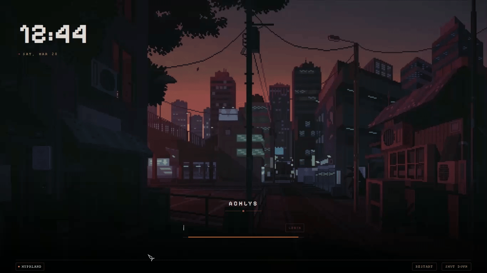
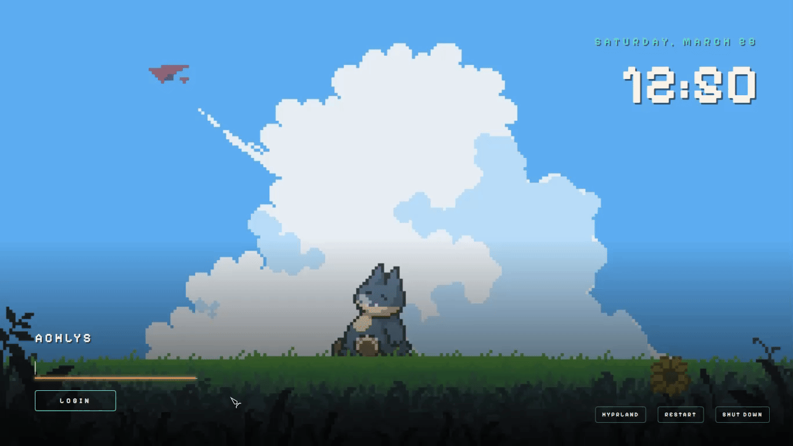
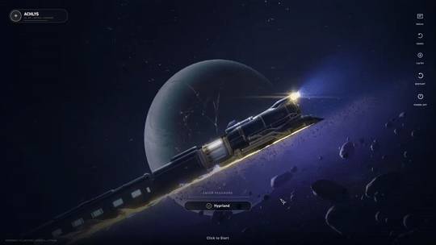

<p align="center">
  
</p>

<p align="center">
  <a href="#sddm-setup"></a>&nbsp;<a href="#quickshell-setup"></a>&nbsp;<a href="https://github.com/Darkkal44/qylock/stargazers"></a>&nbsp;<a href="https://github.com/Darkkal44/qylock"></a>
</p>

<div align="center">
<pre>
<a href="#sddm-setup">ꜱᴅᴅᴍ</a> &nbsp; • &nbsp; <a href="#quickshell-setup">ǫᴜɪᴄᴋsʜᴇʟʟ</a> &nbsp; • &nbsp; <a href="#nix-setup">ɴɪx</a> &nbsp; • &nbsp; <a href="#gallery">ɢᴀʟʟᴇʀʏ</a> &nbsp; • &nbsp; <a href="#credits">ᴄʀᴇᴅɪᴛꜱ</a>
</pre>
</div>

<br>

<p align="center">
  
</p>

<p>Welcome to <b>Qylock</b>! Pretty much a bunch of lockscreen themes I've put together for SDDM and Quickshell. I've always loved the "cozy" and minimalist vibe, so I've tried to keep everything looking clean~ </p>

<p><i>Hope ya find something that fits your setup! Thanks for stopping by!!</i></p>

<br>
<p align="center">━━━━━━━ ❖ ━━━━━━━</p>

<a id="sddm-setup"></a>
<br>

<p align="center">
  
</p>
<br>

Start by installing these dependencies using the package manager of your distro. (Note: Names might vary depending on your distribution.)

#### DEPENDENCIES

| | Packages |
|--:|:---|
| **Core** | `sddm` `qt5-graphicaleffects` `qt5-quickcontrols2` `qt5-svg` |
| **Video · Qt5** | `qt5-multimedia` |
| **Video · Qt6** | `qt6-multimedia-ffmpeg` |
| **GStreamer** | `gst-plugins-base` `gst-plugins-good` `gst-plugins-bad` `gst-plugins-ugly` |
| **Optional** | `fzf` |

<details>
<summary><b>View Font Requirements</b></summary>
<br>

Some themes rely on fonts that cannot be bundled here (copyright issues). Download the font and drop it into `themes/<theme_name>/font/` — it loads automatically.

| Theme | Font | Filename |
|--:|:---|:---|
| NieR: Automata | FOT-Rodin Pro DB | `FOT-Rodin Pro DB.otf` |
| Terraria | Andy Bold | `Andy Bold.ttf` |
| Genshin Impact | HYWenHei-85W | `zhcn.ttf` |
| Sword | The Last Shuriken | `The Last Shuriken.ttf` |
| Minecraft | Minecraft Regular | `minecraft.ttf` |
| Honkai: Star Rail | DIN Next | `DINNextW1G-Medium.otf` |

</details>

<br>

#### INSTALLATION

```sh
chmod +x sddm.sh && ./sddm.sh
```

<br>
<p align="center">━━━━━━━ ❖ ━━━━━━━</p>

<a id="quickshell-setup"></a>
<br>

<p align="center">
  
</p>

<br>

Start by installing these dependencies using the package manager of your distro. (Note: Names might vary depending on your distribution.)
#### DEPENDENCIES

| | Packages |
|--:|:---|
| **Core** | `quickshell` `qt6-declarative` `qt6-5compat` |
| **Video** | `qt6-multimedia` `qt6-multimedia-ffmpeg` |
| **GStreamer** | `gst-plugins-base` `gst-plugins-good` `gst-plugins-bad` `gst-plugins-ugly` |
| **Optional** | `fzf` |

<br>

#### INSTALLATION

```sh
chmod +x quickshell.sh && ./quickshell.sh
```


<br>

#### SHORTCUT BINDING

Point your Window Manager keybind (e.g., in Hyprland, Qtile, Sway, or i3) directly to:

```sh
~/.local/share/quickshell-lockscreen/lock.sh
```

<br>

<p align="center">━━━━━━━ ❖ ━━━━━━━</p>

<a id="nix-setup"></a>
<br>

<p align="center">
  
</p>

<br>

qylock ships a Nix flake with a **NixOS module**, a **Home Manager module**, and a **dev shell**. No manual file copying required — just import and configure.

<br>

### 󱔗 ɴɪxᴏꜱ ᴍᴏᴅᴜʟᴇ

**Step 1 — add the flake input:**

```nix
# flake.nix
{
  inputs = {
    nixpkgs.url = "github:NixOS/nixpkgs/nixos-unstable";
    qylock.url  = "github:LordHerdier/qylock-nix";
  };

  outputs = inputs@{ nixpkgs, qylock, ... }: {
    nixosConfigurations.myhost = nixpkgs.lib.nixosSystem {
      system = "x86_64-linux";
      modules = [
        qylock.nixosModules.default
        ./modules/features/qylock.nix  # your config (see step 2)
        # ... your other modules
      ];
    };
  };
}
```

**Step 2 — configure qylock in a module:**

```nix
# modules/features/qylock.nix
{ ... }:
{
  programs.qylock = {
    enable    = true;
    theme     = "paper";     # Quickshell lockscreen theme
    sddmTheme = "paper";     # optional: also sets services.displayManager.sddm.theme

    # Optional: fonts for themes that require licensed fonts not in the repo.
    # Drop the font file(s) in your config directory and reference them here.
    # sddmThemeFonts = [ ./fonts/zhcn.ttf ];
  };
}
```

> [!NOTE]
> Some SDDM themes require fonts that cannot be redistributed. For those themes, download the font manually and reference it via `sddmThemeFonts` — the file will be copied into the theme's `font/` directory at build time.
>
> | Theme | Font file |
> | :--- | :--- |
> | `Genshin` | `zhcn.ttf` (HYWenHei-85W) |
> | `terraria` | `Andy Bold.ttf` |
> | `nier-automata` | `FOT-Rodin Pro DB.otf` |
> | `sword` | `The Last Shuriken.ttf` |
> | `minecraft` | `minecraft.ttf` |
>
> Example:
> ```nix
> programs.qylock = {
>   enable        = true;
>   sddmTheme     = "Genshin";
>   sddmThemeFonts = [ ./fonts/zhcn.ttf ];
> };
> ```

**Step 3 — enable SDDM with Wayland support** (required for Wayland compositors like Hyprland):

```nix
services.displayManager.sddm = {
  enable         = true;
  wayland.enable = true;
};
```

**Step 4 — bind the lock command in your compositor:**

```ini
# hyprland.conf
bind = SUPER, L, exec, qylock-lock
```

`qylock-lock` is installed automatically by the module. **`sddmTheme`** is optional — when set it installs the SDDM theme package and configures `services.displayManager.sddm.theme` for you.

<br>

### 󱔗 ʜᴏᴍᴇ ᴍᴀɴᴀɢᴇʀ ᴍᴏᴅᴜʟᴇ

```nix
# flake.nix
{
  inputs = {
    nixpkgs.url      = "github:NixOS/nixpkgs/nixos-unstable";
    home-manager.url = "github:nix-community/home-manager";
    qylock.url       = "github:LordHerdier/qylock-nix";
  };

  outputs = { nixpkgs, home-manager, qylock, ... }: {
    homeConfigurations.charlotte = home-manager.lib.homeManagerConfiguration {
      pkgs = nixpkgs.legacyPackages.x86_64-linux;
      modules = [
        qylock.homeManagerModules.default
        {
          programs.qylock = {
            enable = true;
            theme  = "tui/Crimson";
          };
        }
      ];
    };
  };
}
```

<br>

### 󱔗 ᴀᴠᴀɪʟᴀʙʟᴇ ᴛʜᴇᴍᴇꜱ

| `theme` value | Notes |
| :--- | :--- |
| `Genshin` | Time-based day/night cycle (4 videos) |
| `terraria` | 5 biome backgrounds |
| `cyberpunk` | Glitch effects |
| `nier-automata` | Scanner beam & tech overlay |
| `enfield` | Video background |
| `sword` | Video background |
| `porsche` | Video background |
| `ninja_gaiden` | Static |
| `paper` | Minimal static |
| `minecraft` | Static |
| `windows_7` | Static |
| `star_rail` | Video background |
| `wuwa` | Video background |
| `cozytile/Carbon` | — |
| `cozytile/Cozy` | — |
| `cozytile/Everforest` | — |
| `cozytile/Natura` | — |
| `cozytile/Sakura` | — |
| `tui/Amber` | Terminal UI |
| `tui/Amethyst` | Terminal UI |
| `tui/Crimson` | Terminal UI |
| `tui/Emerald` | Terminal UI |
| `tui/Indigo` | Terminal UI |

The same values work for both `theme` (Quickshell lockscreen) and `sddmTheme` (SDDM login screen).

<br>

### 󱔗 ᴅᴇᴠ ꜱʜᴇʟʟ

A dev shell is included for testing themes locally without touching your system:

```sh
nix develop
```

**Test an SDDM theme:**
```sh
# Without a font (theme has bundled assets):
testTheme paper

# With a font file (for themes requiring licensed fonts):
testTheme Genshin ~/fonts/zhcn.ttf
```

**Run the Quickshell lockscreen:**
```sh
quickshell -p $PWD/quickshell-lockscreen
```

> [!NOTE]
> The nixpkgs SDDM package (`kdePackages.sddm`) is Qt6-based. The following compatibility fixes are applied automatically:
> - `QtGraphicalEffects 1.15` imports are shimmed via `kdePackages.qt5compat` (`Qt5Compat.GraphicalEffects`)
> - Video themes use the Qt6 `MediaPlayer` + `VideoOutput` API via shims in `quickshell-lockscreen/imports/`

<br>

<p align="center">━━━━━━━ ◈ ━━━━━━━</p>

<a id="gallery"></a>
<br>

<p align="center">
  
</p>

<br>

<div align="center">
  <table style="border-collapse: collapse; border: none;">
    <tr>
      <td align="center" width="50%" style="padding: 15px; border: none;">
        <b>Pixel · Coffee</b><br><br>
        
      </td>
      <td align="center" width="50%" style="padding: 15px; border: none;">
        <b>Pixel · Dusk City</b><br><br>
        
      </td>
    </tr>
    <tr>
      <td align="center" width="50%" style="padding: 15px; border: none;">
        <b>Pixel · Emerald</b><br><br>
        
      </td>
      <td align="center" width="50%" style="padding: 15px; border: none;">
        <b>Pixel · Hollow Knight</b><br><br>
        
      </td>
    </tr>
    <tr>
      <td align="center" width="50%" style="padding: 15px; border: none;">
        <b>Pixel · Munchax</b><br><br>
        
      </td>
      <td align="center" width="50%" style="padding: 15px; border: none;">
        <b>Pixel · Night City</b><br><br>
        
      </td>
    </tr>
    <tr>
      <td align="center" width="50%" style="padding: 15px; border: none;">
        <b>Pixel · Rainy Room</b><br><br>
        
      </td>
      <td align="center" width="50%" style="padding: 15px; border: none;">
        <b>Pixel · Skyscrapers</b><br><br>
        
      </td>
    </tr>
    <tr>
      <td align="center" width="50%" style="padding: 15px; border: none;">
        <b>NieR: Automata</b><br><br>
        
      </td>
      <td align="center" width="50%" style="padding: 15px; border: none;">
        <b>Terraria</b><br><br>
        
      </td>
    </tr>
    <tr>
      <td align="center" width="50%" style="padding: 15px; border: none;">
        <b>Enfield</b><br><br>
        
      </td>
      <td align="center" width="50%" style="padding: 15px; border: none;">
        <b>Sword</b><br><br>
        
      </td>
    </tr>
    <tr>
      <td align="center" width="50%" style="padding: 15px; border: none;">
        <b>Paper</b><br><br>
        
      </td>
      <td align="center" width="50%" style="padding: 15px; border: none;">
        <b>Windows 7</b><br><br>
        
      </td>
    </tr>
    <tr>
      <td align="center" width="50%" style="padding: 15px; border: none;">
        <b>Cyberpunk</b><br><br>
        
      </td>
      <td align="center" width="50%" style="padding: 15px; border: none;">
        <b>TUI</b><br><br>
        
      </td>
    </tr>
    <tr>
      <td align="center" width="50%" style="padding: 15px; border: none;">
        <b>Porsche</b><br><br>
        
      </td>
      <td align="center" width="50%" style="padding: 15px; border: none;">
        <b>Genshin Impact</b><br><br>
        
      </td>
    </tr>
    <tr>
      <td align="center" width="50%" style="padding: 15px; border: none;">
        <b>Honkai: Star Rail</b><br><br>
        
      </td>
      <td align="center" width="50%" style="padding: 15px; border: none;">
        <b>Wuthering Waves</b><br><br>
        
      </td>
    </tr>
    <tr>
      <td align="center" width="50%" style="padding: 15px; border: none;">
        <b>Ninja Gaiden</b><br><br>
        
      </td>
      <td align="center" width="50%" style="padding: 15px; border: none;">
        <!-- Placeholder for future theme -->
      </td>
    </tr>
  </table>
</div>


<br>

<p align="center">━━━━━━━ ◈ ━━━━━━━</p>

<a id="credits"></a>
<br>

<p align="center">
  
</p>

<div align="center">

| | |
|:---:|:---:|
| ☕ **[max](https://ko-fi.com/B0B1UPVVB)** | Genuinely blown away — thank you! |
| **Pumphium** | Theme suggestions, testing, and late-night debugging. |
| **Qt / QML Community** | The framework powering every theme in this collection. |
| **Unixporn** | Endless aesthetic inspiration and community feedback. |

</div>
<br>
<p align="center">━━━━━━━ ༓ ━━━━━━━</p>

<div align="center">
  <p><i>Make your login your own.</i></p>
  <a href="https://ko-fi.com/darkkal">
    
  </a>
</div>
